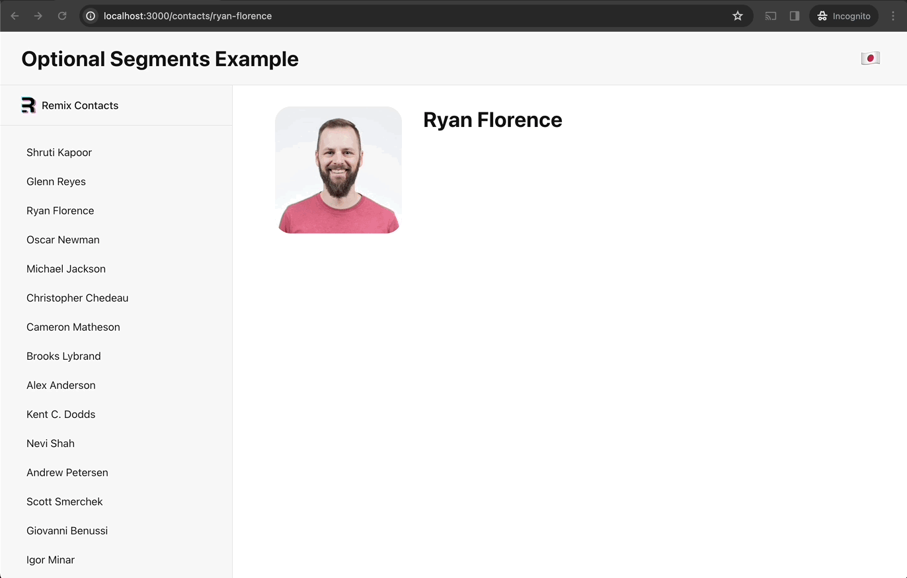

# Remix Optional Segments Example
This is an example of how to use the optional segments feature of Remix.
As this example focuses on the Optional Segments feature, it doesn't have further features from Remix Tutorial, ["Data Mutations"](https://remix.run/docs/en/main/start/tutorial#data-mutations) section and the rest of the tutorial features.

# How it should work
- Select 🇯🇵 on the UI → You'll see localized names in Japanese with `ja` slug in the URL
- Select 🇺🇸 on the UI → You'll see default language names in English without default language slug in the URL

# How to test it locally
1. Fork and clone the repo
2. `npm i`
3. `npm run dev`
4. Open `http://localhost:3000/contacts` in your browser

> [!NOTE]
> If you want to change localized data (names, etc), you can find them in `app/data.ts`.

# Contributing
If you're interested in contributing code to this project, please create a new issue or a PR.
You can see the example PR from Brooks: [PR#1](https://github.com/schabibi1/remix-optional-segments/pull/1)
(Thank you [Brooks](https://github.com/brookslybrand) for reviewing the code and creating the PR! 🙌)